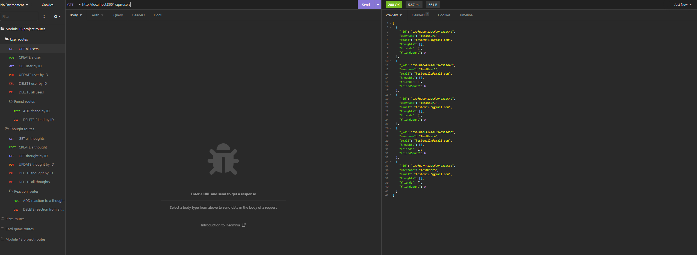

# Module 18 Social Network API challenge

## Description

This is Adrian Jimenez's module 18 social network API challenge submission. 

The project utilizes mongoDB and express to create a backend for a hypothetical social network to use. It allows a site to create, update, and delete users from the database, as well as allows users to create, update, and delete thoughts, which function as their "posts". Users can also create reactions to posts and delete those posts if necessary. All routes and controllers are complete, meaning it would be functional if integrated into a working front-end environment. In addition, if a user is deleted from the database, their thoughts are deleted as well.

## Table of Contents

- [Installation](#installation)
- [Languages](#languages)
- [Usage](#usage)
- [Credits](#credits)
- [License](#license)
- [Contributing](#contributing)
- [Questions](#questions)

## Installation

In order to install this project, download all files and have node.js installed on your machine. Navigate to the directory in which server.js is stored in and type: 

    npm install

Once all dependencies have been downloaded, you can excecute server.js by typing npm start

## Technologies Used

* JavaScript
* Node.JS
* mongoose
* express.js

## Usage

In order to use this project, please make sure you have mongoDB and optionally Insomnia intalled on your machine. Once that is set up, simply execute npm start and the application should start. Insomnia can be used to test the routes.

## Credits

* Adrian Jimenez

## License

This project is licensed under the MIT License. See [LICENSE.md](./LICENSE.md) for more details.

---

## Contributing

This project follows the contributor covenant contribution guidelines. See [here](https://www.contributor-covenant.org/version/2/1/code_of_conduct/) 

## Questions

If you have any questions or concerns visit my [github](https://github.com/PuppetAJ) or send me an email at <adrianjimenez1950@gmail.com>. 

